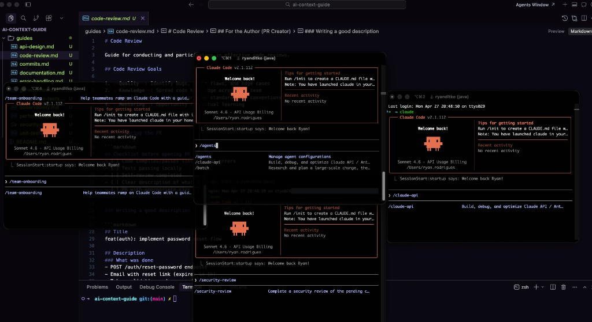

# AI Context Guide



A repository of guides and conventions to use as context in AI chats (Claude, ChatGPT, Cursor, etc.).

## Purpose

This repository contains standardized documentation about development practices that can be attached as context in conversations with AI assistants, ensuring consistent responses aligned with desired conventions.

## Structure

```
guides/
├── commits.md              # Commit conventions (Conventional Commits)
├── git-workflow.md         # Git workflow and branching
│
├── unit-tests.md           # Unit testing with Clean Architecture layers
├── integration-tests.md    # Integration and contract testing
├── testing-strategy.md     # Test pyramid and strategy
│
├── clean-architecture.md   # Clean Architecture principles
├── api-design.md           # REST/GraphQL API design
├── microservices.md        # Microservices patterns
├── database-design.md      # Database modeling and optimization
│
├── error-handling.md       # Error handling patterns
├── performance.md          # Performance optimization
├── debugging.md            # Debugging techniques
│
├── code-review.md          # Code review practices
├── pr-templates.md         # PR and Issue templates
├── refactoring.md          # Safe refactoring techniques
├── naming-conventions.md   # Naming best practices
├── code-style.md           # Linting and formatting
│
├── security.md             # Security practices
├── observability.md        # Logging, metrics, and tracing
├── ci-cd.md                # CI/CD pipelines
├── documentation.md        # Code documentation
│
└── ai-prompts.md           # Prompts for AI assistants
```

## Categories

### Version Control
- **[commits.md](guides/commits.md)** - Conventional Commits standard with examples and tooling
- **[git-workflow.md](guides/git-workflow.md)** - Branching strategies, PR workflow, and Git operations

### Testing
- **[unit-tests.md](guides/unit-tests.md)** - Comprehensive unit testing across Clean Architecture layers (Domain, Application, Adapters, Infrastructure)
- **[integration-tests.md](guides/integration-tests.md)** - Component, database, API, messaging, and contract testing
- **[testing-strategy.md](guides/testing-strategy.md)** - Test pyramid, coverage goals, and CI/CD integration

### Architecture & Design
- **[clean-architecture.md](guides/clean-architecture.md)** - Clean Architecture principles, layers, and implementation patterns
- **[api-design.md](guides/api-design.md)** - REST API design, status codes, versioning
- **[microservices.md](guides/microservices.md)** - Service communication, patterns, and distributed systems
- **[database-design.md](guides/database-design.md)** - Schema design, migrations, indexing, and optimization

### Code Quality
- **[code-review.md](guides/code-review.md)** - Effective code review practices
- **[pr-templates.md](guides/pr-templates.md)** - Templates for PRs (feature, bugfix, refactor, hotfix) and Issues (bug, feature, tech debt, spike)
- **[refactoring.md](guides/refactoring.md)** - Safe refactoring techniques and code smells
- **[naming-conventions.md](guides/naming-conventions.md)** - Consistent naming for variables, functions, classes, files
- **[code-style.md](guides/code-style.md)** - Linting, formatting, and style enforcement

### Error Handling & Performance
- **[error-handling.md](guides/error-handling.md)** - Exception hierarchy, API errors, retry patterns
- **[performance.md](guides/performance.md)** - Database, caching, async, and memory optimization
- **[debugging.md](guides/debugging.md)** - Debugging techniques, tools, and strategies

### Security & Operations
- **[security.md](guides/security.md)** - OWASP Top 10, authentication, secrets management, scanning
- **[observability.md](guides/observability.md)** - Logging, metrics, tracing, and alerting
- **[ci-cd.md](guides/ci-cd.md)** - Pipeline design, deployment strategies, environments

### Documentation
- **[documentation.md](guides/documentation.md)** - Code documentation, ADRs, API docs

### AI Assistance
- **[ai-prompts.md](guides/ai-prompts.md)** - Effective prompts for code generation, review, testing, and debugging

## How to Use

### With Cursor

Attach the relevant file using the `@` symbol:
```
@guides/unit-tests.md
@guides/clean-architecture.md
```

### With Claude/ChatGPT

Copy the guide content at the beginning of the conversation or use the file attachment feature.

### With API

Include the content in the system prompt or as initial context.

## Guide Selection by Task

| Task | Recommended Guides |
|------|-------------------|
| Writing tests | `unit-tests.md`, `testing-strategy.md`, `integration-tests.md` |
| Creating a new feature | `clean-architecture.md`, `naming-conventions.md`, `code-style.md` |
| Opening a PR | `pr-templates.md`, `commits.md` |
| Code review | `code-review.md`, `refactoring.md`, `security.md` |
| Designing an API | `api-design.md`, `error-handling.md` |
| Debugging issues | `debugging.md`, `observability.md`, `ai-prompts.md` |
| Refactoring | `refactoring.md`, `clean-architecture.md`, `testing-strategy.md` |
| Setting up CI/CD | `ci-cd.md`, `testing-strategy.md`, `code-style.md` |
| Database work | `database-design.md`, `performance.md` |
| Building microservices | `microservices.md`, `api-design.md`, `observability.md` |

## Contributing

Feel free to add new guides or improve existing ones following the established pattern:

1. Use clear, actionable language
2. Include code examples in multiple languages where applicable
3. Provide both good and bad examples with explanations
4. Keep content focused and scannable with tables
5. Include checklists for quick reference

## License

MIT
